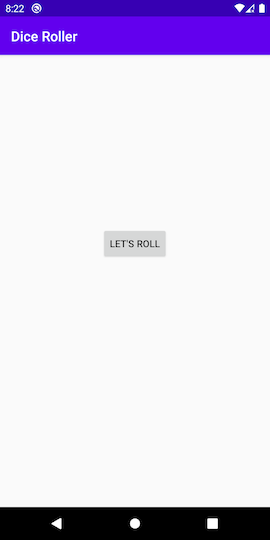
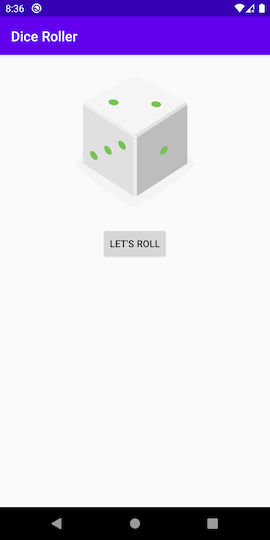

# udacity-roll-dice

A Really simple App created in the Class 1 from course "Developing Android Apps with Kotlin" Udacity.

## Dice Roller

Dice Roller is a simple app that rolls a six sided die.

## Screenshots

 
